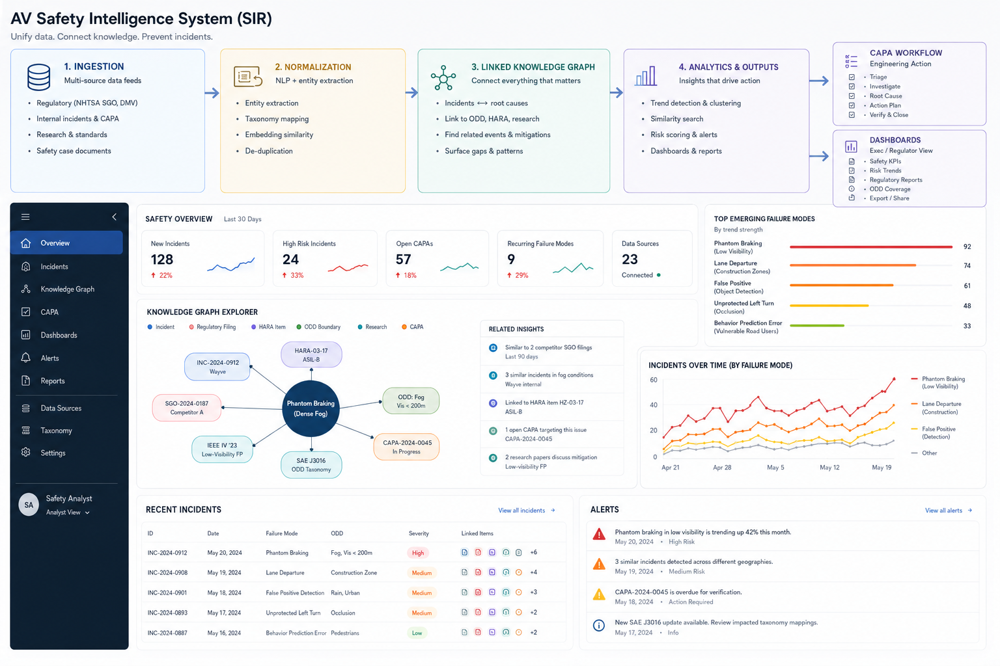

# AV Safety Intelligence System (SIR)

> **A proof-of-concept exploring how fragmented safety information could be connected into a usable operational intelligence system.**

## Live Prototype

### [Launch the Interactive SIR Proof of Concept](https://sorianic.github.io/AV-Safety-Intelligence-System/)

Explore the Incident Registry, Safety Intelligence Registry, CAPA Tracker, and Safety Dashboard as interactive browser-based prototypes.

> **Note:** This is a conceptual portfolio demonstration using synthetic and illustrative data. It is not a production safety system.
---

## Concept Overview

  

AV safety organizations can generate information across many different systems and processes:

- Incident records
- Corrective and preventive actions (CAPA)
- Operational Design Domain (ODD) information
- Hazard analysis
- Regulatory information
- Safety research
- Internal investigations
- Policies and procedures
- Performance trends

The challenge is not always collecting more information.

The challenge is **connecting what the organization already knows.**

SIR explores what a safety intelligence system could look like if these sources were connected so that an analyst investigating one event could quickly understand its broader operational context.

Conceptually:

**Ingest → Normalize → Connect → Analyze → Act → Learn**

---

## Why I Built This

Safety-critical organizations can accumulate enormous amounts of information while still making it difficult for people to find the information they actually need.

An incident may exist in one system.

A corrective action may exist somewhere else.

A similar event may have happened months earlier.

Relevant research may exist outside the organization.

A regulatory filing may describe a related issue.

A hazard analysis may already identify the risk.

The information exists, but the connections between it may not.

SIR explores how those pieces could be brought together into a shared safety intelligence layer.

The objective is not to replace safety professionals or automate safety decisions.

The objective is to help people **find relationships, recognize patterns, investigate efficiently, and make better-informed decisions.**

---

# System Concept

The proof-of-concept is organized around four major functions.

### 1. Incident Registry

A structured location for capturing and reviewing operational safety events.

The concept includes information such as:

- Incident classification
- Severity
- Operational context
- Vehicle information
- Environmental conditions
- Investigation status
- Related documentation

The goal is to establish the event as the starting point for broader investigation rather than treating it as an isolated record.

---

### 2. Linked Safety Intelligence

Individual records become more valuable when they can be connected.

The SIR concept explores relationships between:

- Incidents
- Failure modes
- ODD conditions
- Hazard analyses
- Regulatory information
- CAPAs
- Research
- Policies and standards

Instead of searching each source independently, the system could help surface information related to the event being investigated.

This creates the foundation for a **linked safety knowledge graph**.

---

### 3. Corrective & Preventive Action (CAPA)

Identifying a problem is only useful if the organization can act on it.

The CAPA concept connects findings to:

**Finding → Root Cause → Corrective Action → Ownership → Verification → Closure**

The prototype also explores how an LLM could assist with tasks such as structuring an initial root-cause hypothesis or drafting potential corrective actions for human review.

The public demonstration does **not** connect to a live AI service. AI-assisted functionality is simulated locally to demonstrate the intended workflow without exposing API credentials, consuming external tokens, or representing AI-generated recommendations as actual safety decisions.

Human review and decision authority remain central to the concept.

---

### 4. Safety Analytics

Once safety information is structured and connected, organizations can begin looking beyond individual incidents.

Potential outputs include:

- Recurring failure modes
- Incident trends
- CAPA status
- Risk patterns
- ODD relationships
- Emerging concerns
- Regulatory reporting visibility
- Safety performance indicators

The objective is to move from:

> **What happened?**

toward:

> **What is happening repeatedly, what is connected, and what should we investigate next?**

---

# Proof-of-Concept Prototypes

| Prototype | Purpose |
|:---|:---|
| **[Incident Registry](./prototypes/incident-registry.html)** | Demonstrates structured collection and review of operational incidents. |
| **[Safety Intelligence Registry](./prototypes/safety-intelligence-registry.html)** | Demonstrates relationships between incidents, ODD conditions, hazards, CAPAs, regulatory information, and research. |
| **[CAPA Tracker](./prototypes/capa-tracker.html)** | Demonstrates investigation, root-cause documentation, corrective actions, ownership, and effectiveness verification. |
| **[Safety Dashboard](./prototypes/safety-dashboard.html)** | Demonstrates how connected safety information could support trend analysis and organizational visibility. |

These prototypes are intended to communicate **workflow, architecture, and operational concepts**, not production software.

---

# Role of AI

AI is treated as a supporting capability within SIR rather than the system's decision-maker.

Potential applications include:

- Information normalization
- Entity extraction
- Similarity identification
- Relationship discovery
- Research retrieval
- Pattern recognition
- Drafting assistance
- Investigation support
- Knowledge retrieval

The concept is intentionally **LLM-agnostic**.

An implementation could use an appropriate model based on organizational requirements involving security, privacy, performance, cost, deployment environment, and governance.

AI-generated information should support human analysis, not replace professional judgment or organizational decision authority.

---

# Design Principles

SIR is based on several simple principles:

**Connect before collecting more.**  
Organizations may already possess much of the information needed to understand a problem.

**Make relationships visible.**  
An incident becomes more useful when related hazards, conditions, actions, and prior events can be discovered.

**Keep humans in the decision loop.**  
AI can organize, retrieve, compare, and assist. Safety decisions remain human responsibilities.

**Close the loop.**  
Findings should lead to actions, actions should be verified, and lessons should become available for future investigations.

**Technology should support the operation.**  
The system exists to make safety work easier to perform, not to create another process people have to manage.

---

# Current Status

**Concept / Proof of Concept**

SIR is currently an exploratory portfolio project used to develop and communicate ideas around:

- Safety intelligence
- Knowledge graphs
- Incident management
- CAPA
- Operational analytics
- AI-assisted safety workflows
- Human-centered system design
- Organizational learning

The architecture, terminology, interfaces, workflows, and functionality may continue to change as the concept develops.

---

# Important Disclaimer

> **This repository is an independent conceptual and educational proof of concept.**

SIR is **not a production safety system** and should not be used to make operational, engineering, regulatory, or safety decisions.

Unless a source is specifically identified and cited, the incidents, organizations, vehicle information, regulatory references, identifiers, CAPAs, hazards, metrics, failure modes, dates, statistics, dashboards, alerts, investigation results, and other records displayed within the prototypes are **fictional, synthetic, illustrative, or placeholder data created solely to demonstrate the concept.**

Their appearance within a prototype should **not** be interpreted as a factual claim that an event occurred, that a particular organization experienced the issue shown, or that a regulatory or safety determination was made.

This project is not affiliated with, endorsed by, sponsored by, or representative of any autonomous vehicle manufacturer, autonomous driving company, regulatory agency, government organization, or other entity referenced or implied by the examples.

Any names, terminology, standards, agencies, regulatory programs, or publicly recognizable concepts that appear are used only to provide realistic context for the proof of concept and should not be interpreted as representing the systems, procedures, data, policies, safety performance, or internal practices of those organizations.

---

# About This Work

My background is in safety-critical operations, technical training, operational readiness, safety investigations, and process improvement rather than software engineering.

I use AI-assisted prototyping and system design tools to explore operational problems, test ideas, visualize workflows, and communicate how people, processes, information, and technology could work together.

SIR should therefore be viewed as a demonstration of **operational systems thinking and safety workflow design**, not as production-ready software or a claim of autonomous vehicle engineering expertise.

---

**Nicholas Soria**  
*Operations Architect | Technical Training | Safety-Critical Systems*
